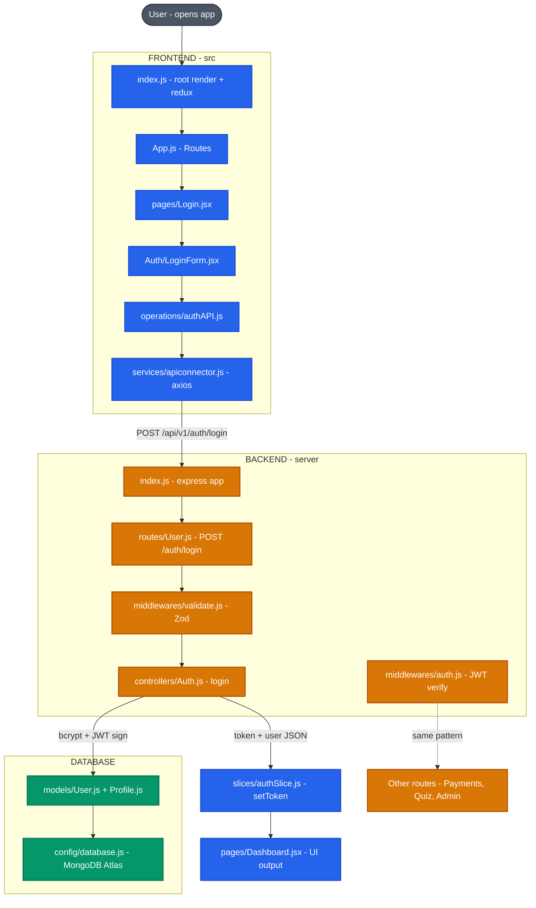

# Kravio Learn

> Learn. Build. Innovate.

An AI-powered Learning Management Platform built with the MERN Stack. Kravio Learn enables instructors to create and manage courses while students browse, purchase, and consume educational content with progress tracking.

**Repository:** [github.com/Vaibhav1077/Kravio-learn](https://github.com/Vaibhav1077/Kravio-learn)

## Tech Stack

**Frontend:** React 18, Redux Toolkit, React Router 6, Tailwind CSS, Axios, Chart.js

**Backend:** Node.js, Express.js, MongoDB, Mongoose, JWT

**Services:** Cloudinary (media), Razorpay (payments), Nodemailer (email)

## Features

- Role-based access control (Student, Instructor, Admin)
- OTP-based email verification and JWT authentication
- Course creation with sections, subsections, and video lectures
- Cart and checkout with Razorpay payment integration
- Course progress tracking with completion percentage
- Ratings and reviews system
- Instructor dashboard with revenue analytics
- Cloud-based media storage via Cloudinary
- Responsive UI with Tailwind CSS

## Getting Started

### Prerequisites

- Node.js 18+
- MongoDB (local or Atlas)
- Cloudinary account
- Razorpay account

### Installation

```bash
# Install frontend dependencies
npm install

# Install backend dependencies
cd server && npm install
```

### Environment Variables

Create a `.env` file in the `server/` directory with the required configuration for MongoDB, JWT, Cloudinary, Razorpay, and mail services.

### Running Locally

```bash
# Run both client and server concurrently
npm run dev

# Or run separately
npm start          # Frontend on port 3000
npm run server     # Backend on port 4000
```

### Production Build

```bash
npm run build
```

## Project Flow Diagram



**Flow:** User → Frontend (React + Redux) → API Layer (Axios) → Backend (Express + Middlewares + Zod Validation) → Database (MongoDB Atlas) → JWT Response → Redux Store → Dashboard UI

## Project Structure

```
├── public/             # Static assets
├── src/                # React frontend
│   ├── components/     # Reusable UI components
│   ├── pages/          # Page-level components
│   ├── services/       # API connector and operations
│   ├── slices/         # Redux Toolkit slices
│   └── utils/          # Constants and helpers
├── server/             # Express backend
│   ├── controllers/    # Route handlers
│   ├── models/         # Mongoose schemas
│   ├── routes/         # Express routes
│   ├── middlewares/    # Auth middleware
│   └── config/         # DB, Cloudinary, Razorpay config
```

## License

MIT

## Author

Vaibhav Kaushal — [GitHub](https://github.com/Vaibhav1077)
